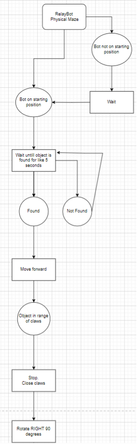
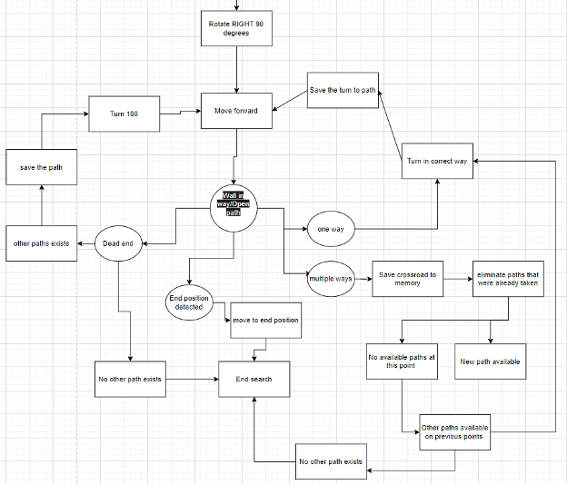

# Physical Maze Follower

Physical Maze Follower is one of the specialized robots for the RelayBot project. The code that controls this robot is written in C++ programming language for Arduino Nano, using PlatformIO in Visual Studio Code.

## Table of Contents
- Requirements
- Installation
- Configuration
- How It Works

## Requirements
- [Visual Studio Code](https://code.visualstudio.com/download)
- [PlatformIO](https://platformio.org/install/ide?install=vscode)
- Arduino Nano AT MEGA 328 
- Integral Neopixle LED’s 
- Rotation Sensors (LM393 Opto-Interrupter) 
- InfraRed Line Sensors 
- Sonar Sensor (HCSR04) 
- 2 Motors 
- Bread-Board
- PCB “Back-Bone” 
- Servo Motor with Integral “Gripper” 
- Bluetooth Wireless Serial Module 
- Power Bank 
- USB Cable 
- H bridge Motor Driver 
- 3 Onboard Push-Buttons 
- 2 Switches 
- Red, Yellow, Green LED’s 
- Robot04 Chasis 

## Installation
- Download Zip file from Github
- Open the folder in Visual Studio Code

## Configuration
- Turn the switches on Arduino Nano off
- Connect Arduino Nano to PC using USB cable
- Verify the port is correctly chosen
- Compile and upload the code
- Reset Arduino Nano

## How It Works
The robot avoids collisions with the walls of the maze by using an Ultrasonic sensor. The robot waits until it is placed on starting position. Then the robot waits until an object is found. After finding the object, the robot moves forward until the object is in range of claws. The robot stops and closes claws. Then the robot rotates right 90 degrees and moves forward. There are four possibilities here.
- If there is a dead end, and no other path exists, the search ends. If other paths exist, the robot saves the path, turns 180 degrees, moves forward, and checks for the four possibilities again.
- If end position is detected, the robot moves to end position, and the search ends.
- If there is one way, the robot turns in correct way, saves the turn to path, moves forward, and checks for the four possibilities again.
- If there are multiple ways, the robot saves the crossroad to memory, eliminates paths that were already taken. If no paths are available at this point, but other paths are available on previous points, the robot turns in correct way, saves the turn to path, moves forward, and checks for the four possibilities again.

